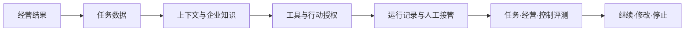

# AI时代的数据治理：管理决策知识库

这是一套面向企业管理者的课后学习材料。它帮助你把课堂方法应用到一个真实工作流，判断：是否值得做、需要什么数据与知识、AI可以行动到哪一步、什么证据支持继续投入。

知识库补充课堂，不替代企业制度、专业判断或正式审批。所有案例均为教学用途；分析自己企业的问题时，请先删除公司名、人名、合同原文、客户信息、账号、密钥和未公开数据。



## 三种使用方式

### 直接阅读

从[知识导航](knowledge.md)选择一条角色路径，每次阅读一张知识卡，再用一个模板完成自己的判断。

### 使用任意Agent

让Agent读取本文件夹，并输入：

> 请使用 `ai-management-decision-coach` skill。先让我说明一个经过脱敏的工作流，再帮助我检查数据、知识、授权和评测证据。不要直接替我给出结论。

即使所用Agent不支持自动加载Skill，也可以要求它先阅读 `.agents/skills/ai-management-decision-coach/SKILL.md`。

### 使用OpenCode

按照[学生使用指南](docs/student-guide.md)和[OpenCode官方说明](https://opencode.ai/docs/)完成安装和模型连接，在本目录运行：

```text
opencode .
```

然后选择一个动作：

```text
/diagnose 供应商交付预警
/knowledge 合同条款核对
/authorize 供应商订单变更
/challenge 集团级AI数据与知识平台
/memo 客户退款与补偿
```

OpenCode会从 `.agents/skills/` 发现课程Skill。仓库不保存模型提供商、API Key或个人配置。

## 建议的第一次学习

1. 选择[管理者路径](docs/paths/executive.md)或与你工作最接近的路径。
2. 用[任务证据表](templates/task-evidence.md)描述一个经过脱敏的工作流。
3. 运行 `/diagnose`，先写出自己的初步判断。
4. 阅读Agent推荐的两到三张卡，不必一次加载整个知识库。
5. 用[投资决策备忘录](templates/investment-memo.md)记录下一步、验证证据和停止条件。

## 内容结构

- `docs/cards/`：12张管理知识卡。
- `docs/paths/`：管理者、制造运营、销售服务、财务人力四条路径。
- `docs/cases/`：供应商流程与客户退款两个脱敏案例。
- `docs/frontier/`：按日期维护的AI能力观察，不与稳定方法混写。
- `templates/`：任务证据、行动授权、投资决策三张模板。
- `.agents/skills/`：可移植的学习Skill。
- `.opencode/commands/`：五个学习命令。
- `MAINTAINERS.md`：教师维护、动态事实复核和发布检查。

## 学习原则

- 从经营结果开始，而不是从模型或工具开始。
- 先判断，再看提示；先给证据，再改结论。
- 区分模型知识、当前上下文、企业知识、任务状态和工具权限。
- 任何不可逆行动都要写清责任人、授权范围和停止条件。
- 厂商发布、公开案例、课程合成情境和个人假设必须分开标识。
